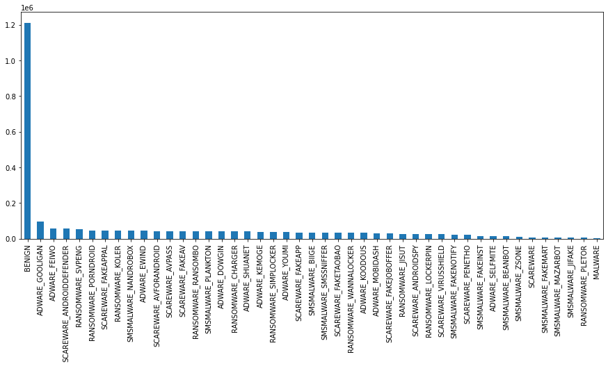

# Tarefas práticas do curso de Ciência de Dados

Repositório utilizado para entrega de trabalhos do curso de Ciência de Dados.

# Tarefas

- [Tarefa 02 - 23/02/2021](https://github.com/efbaro/CDadosSeg/tree/main/T2)

# Exploração de dados

*Dataset* obtido da [UNB (University of New Brunswick)](https://www.unb.ca/cic/datasets/andmal2017.html) chamado **CIC-AndMal2017**, contendo dados de fluxo de tráfego rede de 10.854 aplicações Android sendo 4.354 *malware* e 6.500 de aplicações benignas.

Os dados foram coletados a partir de dispositivos reais e foram classificados em quatro categorias e 42 famílias:

- *Adware*
  - Famílias: [Dowgin, Ewind, Feiwo, Gooligan, Kemoge, koodous, Mobidash, Selfmite, Shuanet, Youmi]
- *Ransomware*
  - Famílias: [Charger, Jisut, Koler, LockerPin, Simplocker, Pletor, PornDroid, RansomBO, Svpeng, WannaLocker]
- *Scareware*
  - Famílias: [AndroidDefender, AndroidSpy, AV for Android, AVpass, FakeApp, FakeApp.ALL, FakeAV, FakeJobOffer, FakeTaoBao, Penetho, VirusShield]
- *SMS Malware*
  - Famílias: [BeanBot, Biige, FakeInst, FakeMart, FakeNotify, Jifake, Mazarbot, Nandrobox, Plankton, SMSsniffer, Zsone]

Os dados possuem 85 características que foram capturadas utilizando o [CICFlowMeter-V3](https://www.unb.ca/cic/research/applications.html#CICFlowMeter) durante três estados: 1. Imediatamente depois da instalação, 2. 15 minutos antes de reiniciar e 3. 15 minutos após reiniciar.

## Que tipos de dados se tem majoritariamente (atributos numéricos, textuais)?

- Os dados do *dataset* são majoritariamente numéricos. Apenas os dados referente as categorias/famílias são textuais. Existem também dados que apesar de numéricos representam valores categóricos como protocolo, e porta.

## Qual o objetivo com esse dataset?

- Gerar um modelo de classificação que permita identificar *Malware* em dispositivos Android.

## O *dataset* é rotulado de que maneira?

- São rotulados por categoria e família de *malware* quando for um *Malware* e com o rótulo *Benign* quando for uma aplicação que não oferece risco ao dispositivo.

- Rótulos:

```
['RANSOMWARE_CHARGER' 'RANSOMWARE_PLETOR' 'RANSOMWARE_WANNALOCKER'
 'RANSOMWARE_KOLER' 'RANSOMWARE_LOCKERPIN' 'RANSOMWARE_SVPENG'
 'RANSOMWARE_RANSOMBO' 'RANSOMWARE_SIMPLOCKER' 'RANSOMWARE_PORNDROID'
 'RANSOMWARE_JISUT' 'SMSMALWARE_PLANKTON' 'SMSMALWARE_FAKEINST'
 'SMSMALWARE_BEANBOT' 'SCAREWARE' nan 'SMSMALWARE_FAKEMART'
 'SMSMALWARE_BIIGE' 'BENIGN' 'SMSMALWARE_JIFAKE' 'SMSMALWARE_NANDROBOX'
 'SMSMALWARE_SMSSNIFFER' 'SMSMALWARE_MAZARBOT' 'SMSMALWARE_ZSONE'
 'SMSMALWARE_FAKENOTIFY' 'ADWARE_KEMOGE' 'ADWARE_YOUMI' 'ADWARE_EWIND'
 'ADWARE_FEIWO' 'ADWARE_KOODOUS' 'ADWARE_SELFMITE' 'ADWARE_DOWGIN'
 'ADWARE_SHUANET' 'ADWARE_MOBIDASH' 'ADWARE_GOOLIGAN'
 'SCAREWARE_ANDROIDSPY' 'SCAREWARE_FAKEAV' 'SCAREWARE_FAKEJOBOFFER'
 'SCAREWARE_FAKEAPP' 'SCAREWARE_FAKEAPPAL' 'SCAREWARE_ANDROIDDEFENDER'
 'SCAREWARE_FAKETAOBAO' 'SCAREWARE_PENETHO' 'MALWARE'
 'SCAREWARE_VIRUSSHIELD' 'SCAREWARE_AVFORANDROID' 'SCAREWARE_AVPASS']
```

## Como é a distribuição dos dados do dataset?

- Os dados possuem majoritariamente exemplos de aplicações benignas, conforme pode-se observar por meio da figura de distribuição das classes abaixo.



- Informações sobre os dados:
  - Número de exemplos: 2.616.579
  - Número de classes: 46
  - Número de características: 85

## Quais colunas/atributos você julga ser interessante manter e remover? Por quê?

- Remover:
  - ***Flow ID***, pois é somente um identificador do exemplo, e foi gerado de maneira artificial e não representa um dado que foi medido ou lido da aplicação.

  - ***Timestamp***, pois neste *dataset* representa apenas a data e hora em que os dados do exemplos foram capturados. Este dado pode atrapalhar a inferência de novos exemplos após o treinamento do modelo, uma vez que datas passadas não se repetirão.

- Manter:
  - Os demais atributos, pois representam dados que podem ajudar na inferência de *Malware*. [Descrição dos atributos do dataset]().

# Autor

Everton Fernando Baro

# Referências

Arash Habibi Lashkari, Andi Fitriah A. Kadir, Laya Taheri, and Ali A. Ghorbani, **“Toward Developing a Systematic Approach to Generate Benchmark Android Malware Datasets and Classification”**, In the proceedings of the 52nd IEEE International Carnahan Conference on Security Technology (ICCST), Montreal, Quebec, Canada, 2018.
